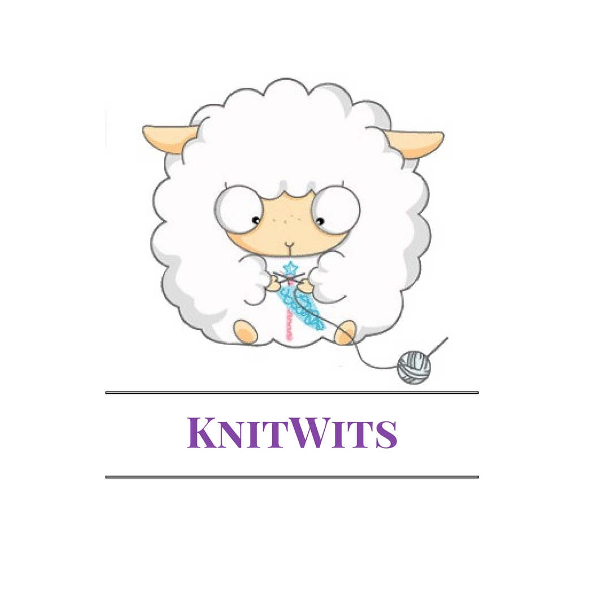
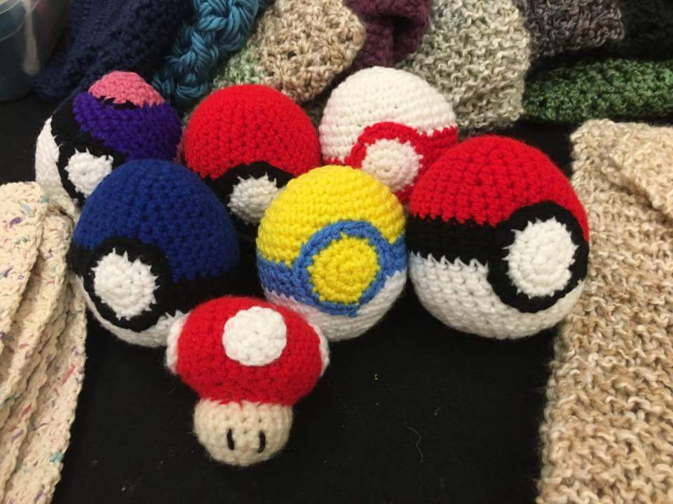
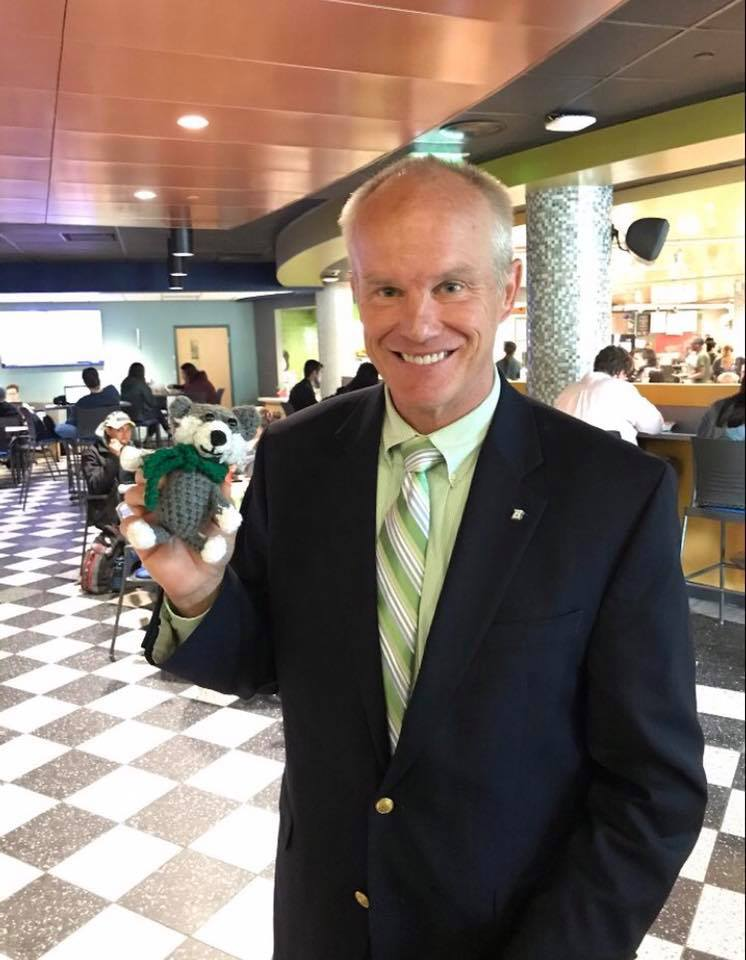
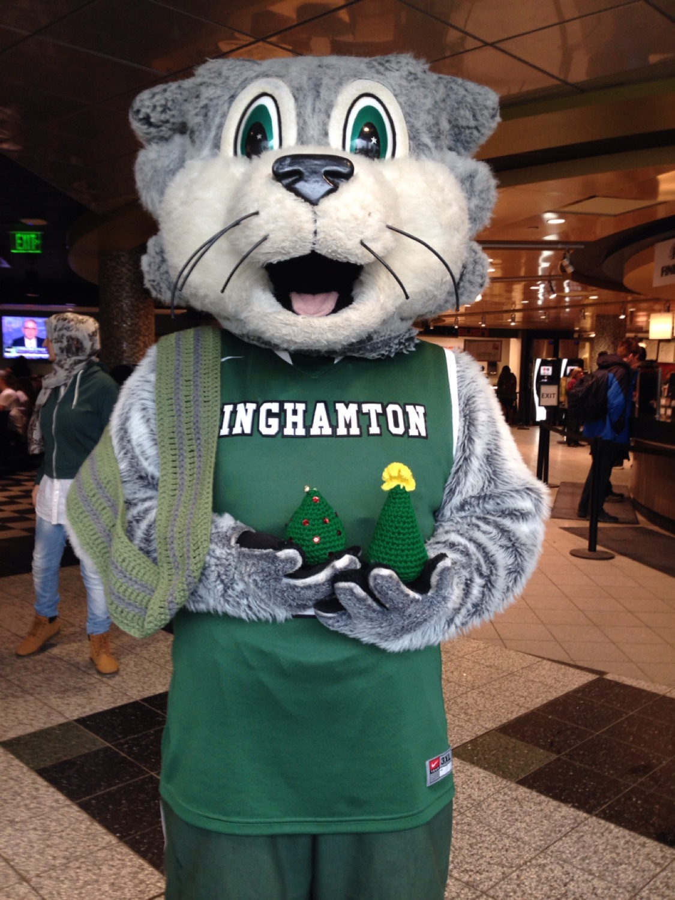
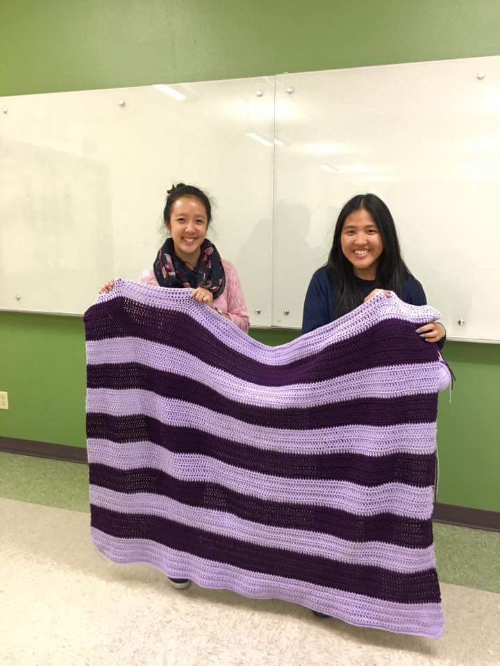
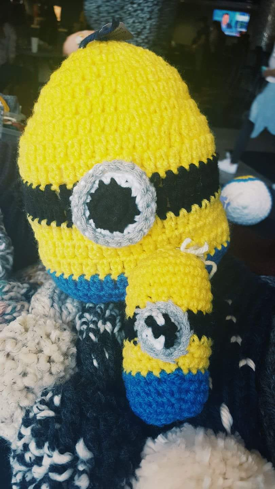

## Welcome to Binghamton University KnitWits

We are an organization of knitters and crocheters who are committed to promoting our craft on the Binghamton campus and within the greater Binghamton area

Our organization meets weekly on Monday nights from 7:30-9:00 PM in University Union 111. We periodically sell our products on campus and at the end of every academic year we select a few charities to donate all proceeds to. 

### Interested in Joining?

If you would like to join KnitWits please sign up for our emails by joining our organization on B-Engaged 
[here](https://bengaged.binghamton.edu/organization/knitwits)

If you would like to contact us with questions or outside inquiries, please shoot us an email at:
[KnitWits@BinghamtonSA.org](KnitWits@BinghamtonSA.org)

We also are on [Facebook!](https://www.facebook.com/BUKnitwits/)

### Our Projects

Interested in custom ordering something? To visit us during one of our sales check out our calender. If you want to custom order something please email us at [KnitWits@BinghamtonSA.org](KnitWits@BinghamtonSA.org) with your order. Remember, all proceeds go to charity so your purchase will do good in more than one way!

We create everything from hats and scarves to stuff animals and blankets. Here are a few samples of our work:

 
 
